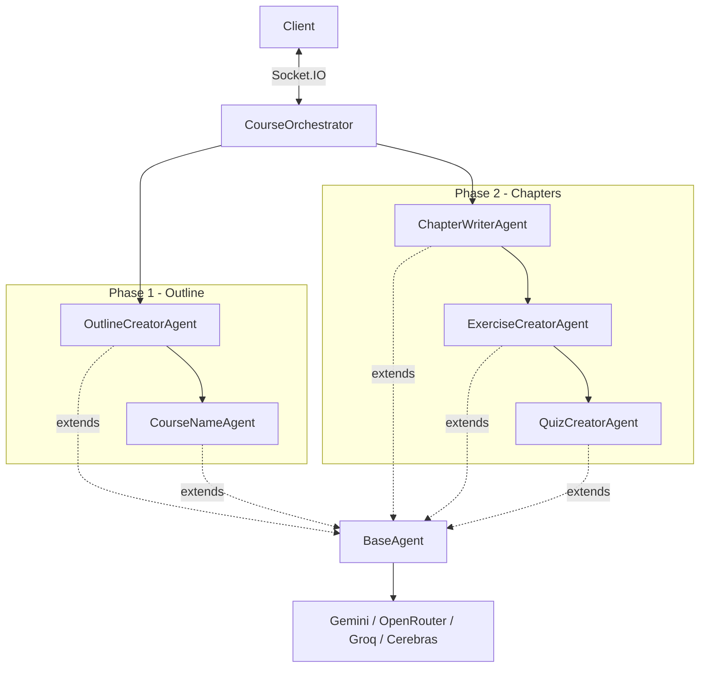

# SyllaBot Pro<sup>2</sup>

**SyllaBot Pro<sup>2</sup>** is an advanced AI-powered course generator designed to create comprehensive educational material on any topic.

It uses Large Language Models (LLMs) to generate structured course outlines, detailed chapters, quizzes, and exercises. The system is built with a real-time, streaming architecture to provide immediate feedback as content is generated.

## Features

- **Multi-Model Support**: Works with Google Gemini (Required), OpenRouter, Groq, and Cerebras.
- **Deep Research**: Optional integration with Tavily AI for web-grounded content and fact-checking.
- **Rich Content**: Generates courses with:
  - Detailed Chapters (with Markdown formatting)
  - Interactive Quizzes directly in the text
  - Practical Exercises
  - Mermaid Diagrams (Flowcharts, Graphs)
  - "Deep Dive" collapsible sections
  - Comparison Tables
- **Real-Time Streaming**: Watch the course being written sentence-by-sentence.
- **Export Options**: Download courses as Markdown, standard DOCX, or styled DOCX.
- **History Management**: Automatically saves generated courses for later viewing or regeneration.

---

## Installation

### Prerequisites

- [Node.js](https://nodejs.org/) (v18 or higher)
- [npm](https://www.npmjs.com/)
- [Pandoc](https://pandoc.org/installing.html) (Required for DOCX export)
- [Git](https://git-scm.com/)

### 1. Clone the Repository

```bash
git clone https://github.com/pverhaert/syllabot-pro2.git
cd syllabot-pro2
```

### 2. Setup & Run

#### Option 1: Windows (Automated)

We provide automated batch scripts to simplify the setup and running process.

1. **Install & Update**: Double-click `install.bat` to:
    - Check for Node.js and Pandoc (and offer to install Pandoc via Chocolatey).
    - Create your `.env` configuration file from the example.
    - Install or update all project dependencies.

2. **Run the Application**: Double-click `run.bat` to:
    - Verify your environment.
    - Automatically clear ports if they are in use.
    - Start the application and open your browser.

#### Option 2: Manual (Cross-Platform)

**Install Dependencies**

This project has a server and a client. You can install all dependencies at once:

```bash
npm install:all
```

*Note: This will install root dependencies. You also need to install dependencies for server and client:*

---

## Configuration (API Keys)

You must configure your API keys in a `.env` file before running the application.

*Note: Restart the application every time you make changes to the .env file.*

1. **Copy the example file**:

   ```bash
   cp .env.example .env
   ```

2. **Edit `.env`**:

   **REQUIRED:**
   - `GEMINI_API_KEY`: Get it from [Google AI Studio](https://aistudio.google.com/). This is the core engine for the application.

   **OPTIONAL** (Add these to enable additional models/features):
   - `OPENROUTER_API_KEY`: For accessing Anthropic, OpenAI, Meta models via [OpenRouter](https://openrouter.ai/).
   - `GROQ_API_KEY`: For ultra-fast Llama 3 inference via [Groq](https://groq.com/).
   - `CEREBRAS_API_KEY`: For high-speed inference via [Cerebras](https://cerebras.ai/).
   - `TAVILY_API_KEY`: For real-time **Web Search** grounding [Tavily](https://tavily.com/).

   **PORTS** (Customize if needed):
   - `SERVER_PORT=3210`
   - `CLIENT_PORT=8448`

   *Note: If you leave an optional key blank (or keep the placeholder "your_..."), that provider/feature will simply be hidden in the UI.*

---

## Usage

### 1. Generate a Course

1. **Topic**: Enter a subject (e.g., "History of Rome", "Python for Data Science").
2. **Configuration**:
    - Select **Language** (English, Dutch, French, etc.).
    - Choose **Audience** (Beginner, Expert, Children).
    - Pick a **Writing Style** (Academic, Storytelling, Socratic).
3. **Model**: Select your preferred AI provider (Gemini is default).
4. **Options**:
    - **Enable Web Search**: (Requires Tavily Key) Grounds content in real-time data.
    - **Mermaid Diagrams**: Visualizes concepts.
    - **Demo Mode**: Generates a short (3-chapter) preview.
5. **Click "Generate Course"**.

### 2. Export

Once finished, click the History button in the bottom left corner.

- **View** the course in the browser.
- **Download DOCX**: Standard formatting or Thomas More College formatting.
- **Download Markdown**: Raw markdown file.

---

## Project Structure

- `client/`: **Frontend** (Vite, TypeScript, Vanilla JS UI). Handles state, WebSocket connections, and rendering.
- `server/`: **Backend** (Node.js, Express). Orchestrates AI agents.
  - `src/agents/`: Specialized agents (Course Namer, Outline Creator, Chapter Writer, etc.).
  - `src/llm/`: Clients for Gemini, OpenRouter, etc.
- `data/`: Output directory.
  - `history/`: Saved markdown files of generated courses.

---

## Agent Architecture

The **CourseOrchestrator** drives the pipeline in two phases, delegating work to specialized agents that all extend `BaseAgent`.


